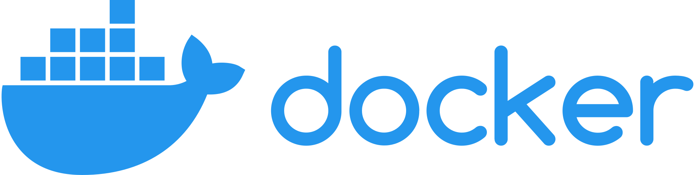

# AMTube
Project for the Laboratory of Advanced Programming exam, Engineering in Computer Science (2021-22) - Sapienza, University of Rome.
## About The Project

AMTube is a web-app where users can publish videos to share content with other users.
It offers the following functionalities:

- presents a landing page with the latest published videos;
- allows to manage user authentication;
- presents a user profile page to update your credentials;
- allows the users to publish, search and watch videos;
- allows the users to subscribe to their favourite content creators to easily access their videos.

## Requirements


To run the project, the requirements are the following:
- Docker (>= v.20.10.12)
- Docker Compose (>= v.2)
## Running The Project
Go in the AMTube directory and run the following command:
```bash
docker-compose up --build -d
```
To check the containers that are running, type:
```bash
docker ps
```
## Documentation
The project's documentation can be found at: [AMTube Documentation](https://github.com/AngeloC99/AMTube/tree/main/Documentation)
## Development Team
- [Angelo Casciani](https://github.com/AngeloC99)
- [Marco De Luca](https://github.com/MarcoDL99)
